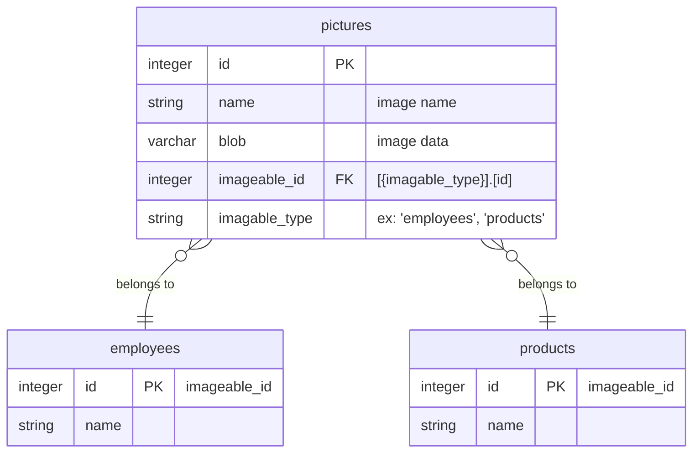
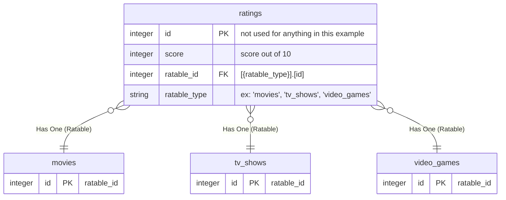

# Polymorphic Associations


## Overview

<!--

-->




## Active Record (Ruby on Rails)

> With polymorphic associations, a model can belong to more than one other model, on a single association. 
> For example, you might have a `Picture` model that belongs to either an `Employee` model or a `Product` model. 
> 
> source: [Rails Guides: Polymorphic Associations][Active Record Associations - Polymorphic Associations]

### Models
```rb
class Rating < ApplicationRecord
  has_one(:ratable, polymorphic: true)
end

class Movie < ApplicationRecord
  has_many(:ratings, as: :ratable)
end

class TvShow < ApplicationRecord
  has_many(:ratings, as: :ratable)
end

class VideoGame < ApplicationRecord
  has_many(:ratings, as: :ratable)
end
```

### Migration
```rb
class CreateRatings < ActiveRecord::Migration[7.1]
  def change()
    create_table(:ratings) do |t|
      t.integer(:score)
      t.bigint(:ratable_id)
      t.string(:ratable_type)
      t.timestamps()
    end
    add_index(:ratings, [:ratable_type, :ratable_id])
  end
end
```

### Usage
```rb
# TODO: ruby usage
```


## Entity Framework Core (C# / ASP.NET Core)

### Models
```cs
public class Ratable 
{
    public int Id { get; } 
}

public class Rating 
{
    public int Score       { get; set; } 
    public int RatableId   { get; set; } 
    public int RatableType { get; set; } 

    public virtual Ratable Ratable { get; set; }
}

public class Movie 
{
    [Key]
    public int Id { get; set; } 
    public virtual ICollection<Ratable> Ratings { get; set; }
}

public class TvShow 
{
    [Key]
    public int Id { get; set; } 
    public virtual ICollection<Ratable> Ratings { get; set; }
}

public class VideoGame
{
    [Key]
    public int Id { get; set; } 
    public virtual ICollection<Ratable> Ratings { get; set; }
}
```

### Context
```cs
public class MyDatabaseContext : DbContext
{
    public DbSet<Rating> Ratings { get; set; }
    public DbSet<Movie> Movies { get; set; }
    public DbSet<TvShow> TvShows { get; set; }
    public DbSet<VideoGame> VideoGames { get; set; }

    protected override void OnModelCreating(ModelBuilder builder)
    {
        builder.Entity<Rating>(entity => {
            entity
                .ToTable("ratings");

            entity
                .HasOne(rating => rating.Ratable)
                .WithMany(ratable => ratable.Ratings)
                .OnDelete(DeleteBehavior.Cascade);
        });
        builder.Entity<Movie>(entity => {
            entity
                .ToTable("movies");

            entity
                .WithMany(movie => movie.Ratings)
                .HasOne(rating => rating.Ratable)
                .OnDelete(DeleteBehavior.Cascade);
        });
    }
}
```


### Usage
```cs
// TODO: C# usage
```


<!-- =================================================================== -->
<!-- Links                                                               -->
<!-- =================================================================== -->


[Active Record Associations - Polymorphic Associations]: https://edgeguides.rubyonrails.org/association_basics.html#polymorphic-associations
